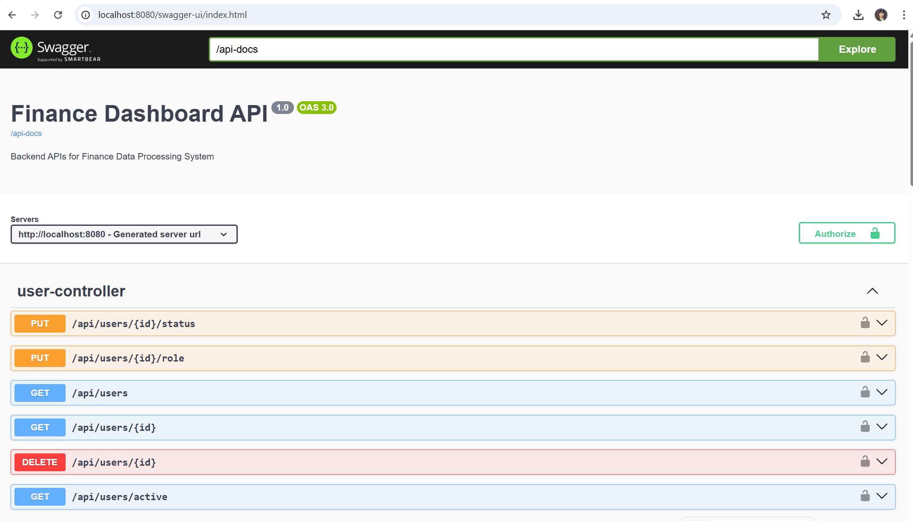
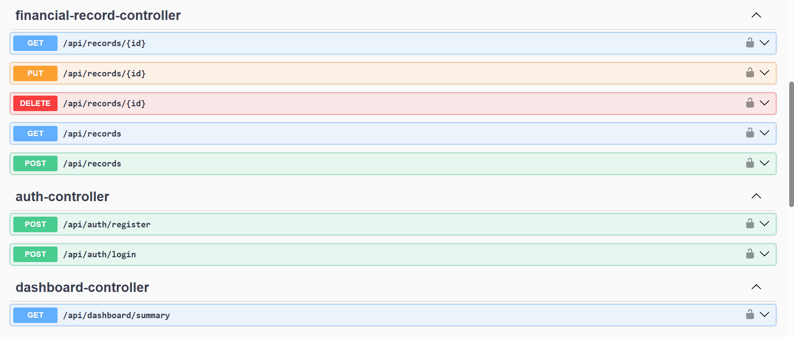
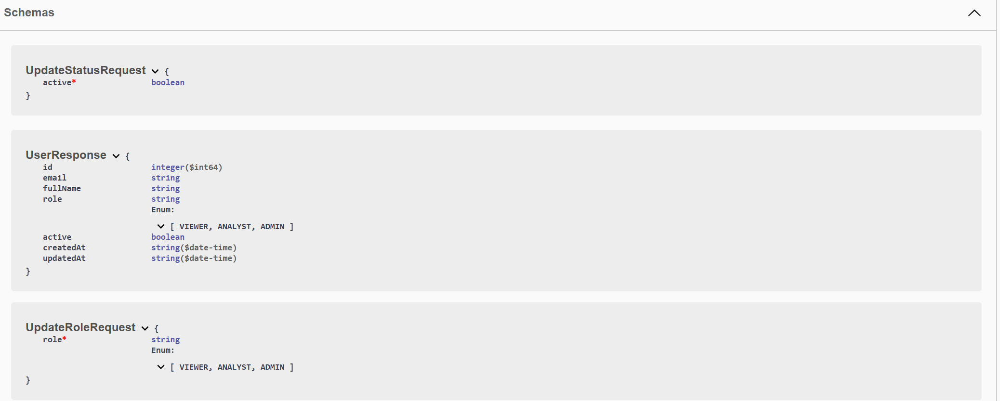
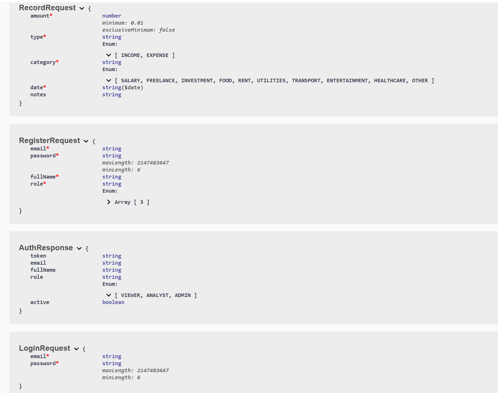

# Finance Data Processing and Access Control Backend

> A production-structured REST API backend built with **Java Spring Boot** for managing financial records with JWT authentication and role-based access control.

---

## Table of Contents

- [Overview](#overview)
- [Tech Stack](#tech-stack)
- [Project Structure](#project-structure)
- [Features](#features)
- [Role Based Access Control](#role-based-access-control)
- [Getting Started](#getting-started)
- [Database Setup](#database-setup)
- [Environment Configuration](#environment-configuration)
- [Running the Application](#running-the-application)
- [API Documentation](#api-documentation)
- [Testing the API](#testing-the-api)
- [Dashboard Summary](#dashboard-summary)
- [Assumptions and Tradeoffs](#assumptions-and-tradeoffs)

---

## Overview

This backend powers a **Finance Dashboard System** where users with different roles interact with financial records. The system supports creating and managing financial entries (income and expenses), role-based access control enforced at the API level, and a suite of dashboard analytics endpoints returning totals, trends, and category breakdowns.

Built as a backend developer internship assignment for **Zorvyn FinTech Pvt. Ltd.**

---

## Tech Stack

| Layer | Technology |
|---|---|
| Language | Java 17 |
| Framework | Spring Boot 3.x |
| Security | Spring Security + JWT (jjwt 0.11.5) |
| Database | MySQL 8 |
| ORM | Spring Data JPA + Hibernate |
| Validation | Jakarta Bean Validation |
| Boilerplate | Lombok |
| API Docs | Springdoc OpenAPI (Swagger UI) |
| Build Tool | Maven |

---

## Project Structure

```
src/main/java/com/finance/dashboard/
├── config/
│   └── SecurityConfig.java          # JWT filter chain, role-based route guards
├── controller/
│   ├── AuthController.java          # POST /api/auth/register, /login
│   ├── UserController.java          # CRUD for users (ADMIN only)
│   ├── FinancialRecordController.java  # CRUD + filtering for records
│   └── DashboardController.java     # Summary, trends, category analytics
├── dto/
│   ├── request/
│   │   ├── LoginRequest.java
│   │   ├── RegisterRequest.java
│   │   ├── RecordRequest.java
│   │   ├── UpdateRoleRequest.java
│   │   └── UpdateStatusRequest.java
│   └── response/
│       ├── AuthResponse.java
│       ├── UserResponse.java
│       └── DashboardSummaryResponse.java
├── entity/
│   ├── User.java                    # Users table with role and active status
│   └── FinancialRecord.java         # Financial records with soft delete
├── enums/
│   ├── Role.java                    # VIEWER, ANALYST, ADMIN
│   ├── RecordType.java              # INCOME, EXPENSE
│   └── Category.java                # SALARY, RENT, FOOD, etc.
├── exception/
│   ├── GlobalExceptionHandler.java  # Centralized error responses
│   ├── ResourceNotFoundException.java
│   ├── DuplicateEmailException.java
│   └── AccountDeactivatedException.java
├── repository/
│   ├── UserRepository.java
│   └── FinancialRecordRepository.java  # Custom @Query for filters and aggregates
├── security/
│   ├── JwtUtil.java                 # Token generation and validation
│   ├── JwtAuthFilter.java           # Per-request JWT validation filter
│   └── CustomUserDetailsService.java
└── service/
    ├── AuthService.java             # Register, login, token issuance
    ├── UserService.java             # User CRUD, role and status management
    ├── FinancialRecordService.java  # Record CRUD, soft delete, filtering
    └── DashboardService.java        # Aggregated analytics queries
```

---

## Features

### Core
- **User and Role Management** — create users, assign roles (VIEWER / ANALYST / ADMIN), activate or deactivate accounts
- **Financial Records CRUD** — create, read, update, and soft-delete income and expense entries
- **Record Filtering** — filter records by type, category, and date range with pagination
- **Dashboard Summary APIs** — total income, total expenses, net balance, category-wise breakdown, monthly trends, and recent activity
- **Role Based Access Control** — enforced at the Spring Security layer, not just in business logic
- **JWT Authentication** — stateless token-based auth, token expires in 24 hours
- **Input Validation** — all request bodies validated with Jakarta Bean Validation, structured error responses
- **Soft Delete** — records are never physically removed, just flagged `deleted = true`
- **Swagger UI** — interactive API documentation at `/swagger-ui.html`

---

## Role Based Access Control

| Action | VIEWER | ANALYST | ADMIN |
|---|:---:|:---:|:---:|
| Login / Register | ✅ | ✅ | ✅ |
| View records | ✅ | ✅ | ✅ |
| View dashboard summary | ✅ | ✅ | ✅ |
| Create records | ❌ | ✅ | ✅ |
| Update records | ❌ | ✅ | ✅ |
| Delete records (soft) | ❌ | ❌ | ✅ |
| View all users | ❌ | ❌ | ✅ |
| Change user roles | ❌ | ❌ | ✅ |
| Activate / deactivate users | ❌ | ❌ | ✅ |
| Delete users | ❌ | ❌ | ✅ |

---

## Getting Started

### Prerequisites

- Java 17 or higher
- Maven 3.8+
- MySQL 8 running locally

### Clone the repository

```bash
git clone https://github.com/your-username/finance-dashboard-backend.git
cd finance-dashboard-backend
```

---

## Database Setup

Create the database in MySQL before starting the application:

```sql
CREATE DATABASE finance_db;
```

Then load the seed data to get 5 users and 20 financial records ready for testing:

```sql
USE finance_db;
```

---


## 📸 API Screenshots

### 🔐 Authentication APIs


---

### 👤 User Management APIs (ADMIN)


---

### 💰 Financial Records APIs


---

### 📊 Dashboard Analytics APIs


---

### 🧩 Data Schemas


## Environment Configuration

Edit `src/main/resources/application.properties`:

```properties
# MySQL
spring.datasource.url=jdbc:mysql://localhost:3306/finance_db?useSSL=false&serverTimezone=UTC&allowPublicKeyRetrieval=true
spring.datasource.username=root
spring.datasource.password=your_mysql_password
spring.datasource.driver-class-name=com.mysql.cj.jdbc.Driver

# JPA
spring.jpa.hibernate.ddl-auto=update
spring.jpa.show-sql=true
spring.jpa.properties.hibernate.dialect=org.hibernate.dialect.MySQL8Dialect

# JWT (use a long random string in production)
jwt.secret=your-256-bit-secret-key-here-make-it-long-enough
jwt.expiration=86400000

# Swagger
springdoc.api-docs.path=/api-docs
springdoc.swagger-ui.path=/swagger-ui.html
```

---

## Running the Application

```bash
./mvnw spring-boot:run
```

The API starts at:

```
http://localhost:8080
```

Swagger UI is available at:

```
http://localhost:8080/swagger-ui.html
```

---

## API Documentation

### Auth endpoints — public, no token required

| Method | Endpoint | Description |
|---|---|---|
| POST | `/api/auth/register` | Create a new user account |
| POST | `/api/auth/login` | Login and receive a JWT token |

**Register request body:**
```json
{
  "email": "admin@finance.com",
  "password": "admin123",
  "fullName": "Admin User",
  "role": "ADMIN"
}
```

**Login request body:**
```json
{
  "email": "admin@finance.com",
  "password": "admin123"
}
```

**Auth response:**
```json
{
  "token": "eyJhbGciOiJIUzI1NiJ9...",
  "email": "admin@finance.com",
  "fullName": "Admin User",
  "role": "ADMIN",
  "active": true
}
```

> Copy the `token` value and use it as `Authorization: Bearer <token>` on all subsequent requests.

---

### User endpoints — ADMIN token required

| Method | Endpoint | Description |
|---|---|---|
| GET | `/api/users` | Get all users |
| GET | `/api/users/active` | Get only active users |
| GET | `/api/users/{id}` | Get a single user |
| PUT | `/api/users/{id}/role` | Change a user's role |
| PUT | `/api/users/{id}/status` | Activate or deactivate a user |
| DELETE | `/api/users/{id}` | Hard delete a user |

**Update role request body:**
```json
{ "role": "ANALYST" }
```

**Update status request body:**
```json
{ "active": false }
```

---

### Financial record endpoints

| Method | Endpoint | Role required | Description |
|---|---|---|---|
| GET | `/api/records` | VIEWER+ | List records with optional filters |
| GET | `/api/records/{id}` | VIEWER+ | Get a single record |
| POST | `/api/records` | ANALYST+ | Create a new record |
| PUT | `/api/records/{id}` | ANALYST+ | Update a record |
| DELETE | `/api/records/{id}` | ADMIN | Soft delete a record |

**Create / update record request body:**
```json
{
  "amount": 50000.00,
  "type": "INCOME",
  "category": "SALARY",
  "date": "2024-03-01",
  "notes": "March salary"
}
```

**Filter parameters for GET `/api/records`:**

| Parameter | Type | Example | Description |
|---|---|---|---|
| `type` | enum | `INCOME` | Filter by record type |
| `category` | enum | `SALARY` | Filter by category |
| `from` | date | `2024-01-01` | Start date (inclusive) |
| `to` | date | `2024-03-31` | End date (inclusive) |
| `page` | int | `0` | Page number (default 0) |
| `size` | int | `10` | Page size (default 20) |

**Filter examples:**
```
GET /api/records?type=INCOME
GET /api/records?type=EXPENSE&category=RENT
GET /api/records?from=2024-01-01&to=2024-03-31
GET /api/records?type=EXPENSE&from=2024-01-01&to=2024-04-30&page=0&size=10
```

---

### Dashboard endpoint

| Method | Endpoint | Role required | Description |
|---|---|---|---|
| GET | `/api/dashboard/summary` | VIEWER+ | Full dashboard analytics |

**Dashboard response:**
```json
{
  "totalIncome": 377000.00,
  "totalExpenses": 90100.00,
  "netBalance": 286900.00,
  "incomeByCategory": {
    "SALARY": 300000.00,
    "FREELANCE": 55000.00,
    "INVESTMENT": 22000.00
  },
  "expensesByCategory": {
    "RENT": 60000.00,
    "FOOD": 8300.00,
    "UTILITIES": 3200.00,
    "TRANSPORT": 6900.00,
    "HEALTHCARE": 5500.00,
    "ENTERTAINMENT": 6200.00
  },
  "monthlyIncomeTrend": [
    { "month": "2024-01", "amount": 93000.00 },
    { "month": "2024-02", "amount": 87500.00 },
    { "month": "2024-03", "amount": 106500.00 },
    { "month": "2024-04", "amount": 90000.00 }
  ],
  "monthlyExpenseTrend": [
    { "month": "2024-01", "amount": 27700.00 },
    { "month": "2024-02", "amount": 28300.00 },
    { "month": "2024-03", "amount": 34000.00 },
    { "month": "2024-04", "amount": 4100.00 }
  ],
  "recentActivity": [
    {
      "id": "10000019-0000-0000-0000-000000000019",
      "amount": 4100.00,
      "type": "EXPENSE",
      "category": "TRANSPORT",
      "date": "2024-04-16",
      "notes": "Monthly travel expenses"
    }
  ]
}
```

---

## Testing the API

### Seed login credentials

| Email | Password | Role | Active |
|---|---|---|---|
| `admin@finance.com` | `password` | ADMIN | yes |
| `analyst1@finance.com` | `password` | ANALYST | yes |
| `analyst2@finance.com` | `password` | ANALYST | yes |
| `viewer1@finance.com` | `password` | VIEWER | yes |
| `viewer2@finance.com` | `password` | VIEWER | **no** — tests 401 on deactivated account |

### Postman quick setup

1. Create a collection called **Finance Dashboard**
2. Add a collection variable `base_url` = `http://localhost:8080`
3. Add a collection variable `token` = *(leave empty)*
4. In the **login** request, add this script to the **Tests** tab:

```javascript
const res = pm.response.json();
pm.collectionVariables.set("token", res.token);
```

5. Set the `Authorization` header on all other requests to:

```
Bearer {{token}}
```

### Valid enum values

| Field | Valid values |
|---|---|
| `role` | `VIEWER`, `ANALYST`, `ADMIN` |
| `type` | `INCOME`, `EXPENSE` |
| `category` | `SALARY`, `FREELANCE`, `INVESTMENT`, `FOOD`, `RENT`, `UTILITIES`, `TRANSPORT`, `ENTERTAINMENT`, `HEALTHCARE`, `OTHER` |

### Error response format

All errors return a consistent JSON structure:

```json
{ "status": 400, "message": "Descriptive error message" }
```

```json
{ "status": 400, "errors": { "email": "must be a well-formed email address" } }
```

| Scenario | HTTP Status |
|---|---|
| Validation failure | 400 |
| Duplicate email on register | 409 |
| Wrong credentials / deactivated account | 401 |
| Resource not found | 404 |
| Insufficient role | 403 |
| Server error | 500 |

---

## Dashboard Summary

Expected results from the seed data (19 visible records, 1 soft-deleted):

| Metric | Value |
|---|---|
| Total income | 3,77,000.00 |
| Total expenses | 90,100.00 |
| Net balance | 2,86,900.00 |
| Visible records via API | 19 |
| Total records in DB | 20 |
| Soft-deleted records | 1 |

---


Here is every API endpoint with full request bodies, headers, and expected responses — ready to test in Postman or any HTTP client.

---

## Base URL
```
http://localhost:8080
```

---

## 1 — Auth endpoints (Public — no token needed)

### Register
```http
POST /api/auth/register
Content-Type: application/json

{
  "email": "admin@finance.com",
  "password": "admin123",
  "fullName": "Admin User",
  "role": "ADMIN"
}
```

**Expected response `201`:**
```json
{
  "token": "eyJhbGciOiJIUzI1NiJ9...",
  "email": "admin@finance.com",
  "fullName": "Admin User",
  "role": "ADMIN",
  "active": true
}
```

---

### Register an Analyst
```http
POST /api/auth/register
Content-Type: application/json

{
  "email": "analyst@finance.com",
  "password": "analyst123",
  "fullName": "Analyst User",
  "role": "ANALYST"
}
```

---

### Register a Viewer
```http
POST /api/auth/register
Content-Type: application/json

{
  "email": "viewer@finance.com",
  "password": "viewer123",
  "fullName": "Viewer User",
  "role": "VIEWER"
}
```

---

### Login
```http
POST /api/auth/login
Content-Type: application/json

{
  "email": "admin@finance.com",
  "password": "admin123"
}
```

**Expected response `200`:**
```json
{
  "token": "eyJhbGciOiJIUzI1NiJ9...",
  "email": "admin@finance.com",
  "fullName": "Admin User",
  "role": "ADMIN",
  "active": true
}
```

> Copy the `token` value — use it as `Bearer <token>` in all requests below.

---

## 2 — User endpoints (ADMIN token required)

### Get all users
```http
GET /api/users
Authorization: Bearer <admin_token>
```

**Expected response `200`:**
```json
[
  {
    "id": "550e8400-e29b-41d4-a716-446655440000",
    "email": "admin@finance.com",
    "fullName": "Admin User",
    "role": "ADMIN",
    "active": true,
    "createdAt": "2024-03-01T10:00:00",
    "updatedAt": "2024-03-01T10:00:00"
  }
]
```

---

### Get only active users
```http
GET /api/users/active
Authorization: Bearer <admin_token>
```

---

### Get single user
```http
GET /api/users/{id}
Authorization: Bearer <admin_token>
```

**Example:**
```http
GET /api/users/550e8400-e29b-41d4-a716-446655440000
Authorization: Bearer <admin_token>
```

---

### Update user role
```http
PUT /api/users/{id}/role
Authorization: Bearer <admin_token>
Content-Type: application/json

{
  "role": "ANALYST"
}
```

Valid role values: `VIEWER`, `ANALYST`, `ADMIN`

---

### Update user status (activate / deactivate)
```http
PUT /api/users/{id}/status
Authorization: Bearer <admin_token>
Content-Type: application/json

{
  "active": false
}
```

---

### Delete user
```http
DELETE /api/users/{id}
Authorization: Bearer <admin_token>
```

**Expected response `200`:**
```json
{
  "message": "User deleted successfully"
}
```

---

## 3 — Financial Records endpoints

### Create a record (ANALYST or ADMIN token)
```http
POST /api/records
Authorization: Bearer <admin_token>
Content-Type: application/json

{
  "amount": 50000.00,
  "type": "INCOME",
  "category": "SALARY",
  "date": "2024-03-01",
  "notes": "March salary"
}
```

**Expected response `201`:**
```json
{
  "id": "abc123...",
  "amount": 50000.00,
  "type": "INCOME",
  "category": "SALARY",
  "date": "2024-03-01",
  "notes": "March salary",
  "deleted": false,
  "createdAt": "2024-03-01T10:00:00"
}
```

---

### Create more records (run these to get useful dashboard data)

**Expense — Rent:**
```http
POST /api/records
Authorization: Bearer <admin_token>
Content-Type: application/json

{
  "amount": 15000.00,
  "type": "EXPENSE",
  "category": "RENT",
  "date": "2024-03-02",
  "notes": "Monthly rent"
}
```

**Expense — Food:**
```http
POST /api/records
Authorization: Bearer <admin_token>
Content-Type: application/json

{
  "amount": 3500.00,
  "type": "EXPENSE",
  "category": "FOOD",
  "date": "2024-03-05",
  "notes": "Groceries"
}
```

**Income — Freelance:**
```http
POST /api/records
Authorization: Bearer <admin_token>
Content-Type: application/json

{
  "amount": 12000.00,
  "type": "INCOME",
  "category": "FREELANCE",
  "date": "2024-03-10",
  "notes": "Website project"
}
```

**Expense — Transport:**
```http
POST /api/records
Authorization: Bearer <admin_token>
Content-Type: application/json

{
  "amount": 2000.00,
  "type": "EXPENSE",
  "category": "TRANSPORT",
  "date": "2024-03-12",
  "notes": "Fuel and cab"
}
```

**Income — Investment:**
```http
POST /api/records
Authorization: Bearer <admin_token>
Content-Type: application/json

{
  "amount": 8000.00,
  "type": "INCOME",
  "category": "INVESTMENT",
  "date": "2024-02-15",
  "notes": "Mutual fund returns"
}
```

---

### Get all records (no filters)
```http
GET /api/records
Authorization: Bearer <admin_token>
```

---

### Get records with pagination
```http
GET /api/records?page=0&size=5
Authorization: Bearer <admin_token>
```

---

### Filter by type
```http
GET /api/records?type=INCOME
Authorization: Bearer <admin_token>
```

```http
GET /api/records?type=EXPENSE
Authorization: Bearer <admin_token>
```

---

### Filter by category
```http
GET /api/records?category=SALARY
Authorization: Bearer <admin_token>
```

```http
GET /api/records?category=RENT
Authorization: Bearer <admin_token>
```

---

### Filter by date range
```http
GET /api/records?from=2024-03-01&to=2024-03-31
Authorization: Bearer <admin_token>
```

---

### Combined filters
```http
GET /api/records?type=EXPENSE&category=FOOD&from=2024-01-01&to=2024-12-31&page=0&size=10
Authorization: Bearer <admin_token>
```

---

### Get single record
```http
GET /api/records/{id}
Authorization: Bearer <admin_token>
```

---

### Update a record (ANALYST or ADMIN)
```http
PUT /api/records/{id}
Authorization: Bearer <admin_token>
Content-Type: application/json

{
  "amount": 55000.00,
  "type": "INCOME",
  "category": "SALARY",
  "date": "2024-03-01",
  "notes": "March salary revised"
}
```

---

### Delete a record — soft delete (ADMIN only)
```http
DELETE /api/records/{id}
Authorization: Bearer <admin_token>
```

**Expected response `200`:**
```json
{
  "message": "Record deleted"
}
```

---

## 4 — Dashboard endpoints (VIEWER and above)

### Full dashboard summary
```http
GET /api/dashboard/summary
Authorization: Bearer <viewer_token>
```

**Expected response `200`:**
```json
{
  "totalIncome": 70000.00,
  "totalExpenses": 20500.00,
  "netBalance": 49500.00,
  "incomeByCategory": {
    "SALARY": 50000.00,
    "FREELANCE": 12000.00,
    "INVESTMENT": 8000.00
  },
  "expensesByCategory": {
    "RENT": 15000.00,
    "FOOD": 3500.00,
    "TRANSPORT": 2000.00
  },
  "monthlyIncomeTrend": [
    { "month": "2024-02", "amount": 8000.00 },
    { "month": "2024-03", "amount": 62000.00 }
  ],
  "monthlyExpenseTrend": [
    { "month": "2024-03", "amount": 20500.00 }
  ],
  "recentActivity": [
    {
      "id": "abc123",
      "amount": 2000.00,
      "type": "EXPENSE",
      "category": "TRANSPORT",
      "date": "2024-03-12",
      "notes": "Fuel and cab"
    }
  ]
}
```

---

## 5 — Validation error tests

### Missing required fields
```http
POST /api/auth/register
Content-Type: application/json

{
  "email": "bad-email",
  "password": "123"
}
```

**Expected response `400`:**
```json
{
  "status": 400,
  "errors": {
    "email": "must be a well-formed email address",
    "password": "size must be between 6 and 2147483647",
    "fullName": "must not be blank",
    "role": "must not be null"
  }
}
```

---

### Invalid amount
```http
POST /api/records
Authorization: Bearer <admin_token>
Content-Type: application/json

{
  "amount": -100,
  "type": "INCOME",
  "category": "SALARY",
  "date": "2024-03-01"
}
```

**Expected response `400`:**
```json
{
  "status": 400,
  "errors": {
    "amount": "must be greater than or equal to 0.01"
  }
}
```

---

### Access denied — VIEWER tries to create record
```http
POST /api/records
Authorization: Bearer <viewer_token>
Content-Type: application/json

{
  "amount": 1000,
  "type": "INCOME",
  "category": "SALARY",
  "date": "2024-03-01"
}
```

**Expected response `403`:**
```json
{
  "status": 403,
  "message": "Access denied"
}
```

---

### No token provided
```http
GET /api/records
```

**Expected response `403` or `401`**

---

### Record not found
```http
GET /api/records/non-existent-id
Authorization: Bearer <admin_token>
```

**Expected response `404`:**
```json
{
  "status": 404,
  "message": "Record not found"
}
```

---

## 6 — Valid enum values reference

| Field | Valid values |
|-------|-------------|
| `role` | `VIEWER`, `ANALYST`, `ADMIN` |
| `type` | `INCOME`, `EXPENSE` |
| `category` | `SALARY`, `FREELANCE`, `INVESTMENT`, `FOOD`, `RENT`, `UTILITIES`, `TRANSPORT`, `ENTERTAINMENT`, `HEALTHCARE`, `OTHER` |

---

## Postman quick setup

1. Create a collection called **Finance Dashboard**
2. Add a collection variable `base_url` = `http://localhost:8080`
3. Add a collection variable `token` = *(empty for now)*
4. In the **login** request, add this to the **Tests** tab to auto-save the token:

```javascript
const res = pm.response.json();
pm.collectionVariables.set("token", res.token);
```

5. In all other requests set the header:
```
Authorization: Bearer {{token}}
```

This way you login once and every other request automatically uses the saved token.

## Assumptions and Tradeoffs

| Topic | Decision | Reason |
|---|---|---|
| Role assignment on register | `role` field accepted in the register body | For demo and testing convenience; in production this would be admin-only |
| Soft delete | Records flagged `deleted = true`, never physically removed | Preserves audit history and data integrity |
| JWT storage | Client-side; 24-hour expiry configured in properties | Stateless and scalable; no server-side session needed |
| Role model | Flat (VIEWER, ANALYST, ADMIN) — no hierarchy | Simpler to reason about and enforce; sufficient for this use case |
| Monthly trend query | Native MySQL query using `DATE_FORMAT` | JPQL does not support `DATE_FORMAT`; native query is cleaner than a Hibernate function workaround |
| H2 compatibility | `DATE_FORMAT` is MySQL-specific | Swap to `FORMATDATETIME(date, 'yyyy-MM')` in `FinancialRecordRepository` if switching to H2 for local dev |
| Password in seed SQL | BCrypt hash of the word `password` | For testing only — never use weak passwords in production |
| Pagination | Applied on record listing; dashboard recent activity hardcoded to last 10 entries | Keeps the dashboard endpoint simple and fast |
| Rate limiting | Not implemented | Out of scope for this assessment; would add via a library like Bucket4j in production |
| Unit tests | Not included | Out of scope for this assessment; service layer is structured to be easily testable with Mockito |

---

## Author

**Rishik Arya**
Backend Developer Intern Assignment — Zorvyn FinTech Pvt. Ltd.
